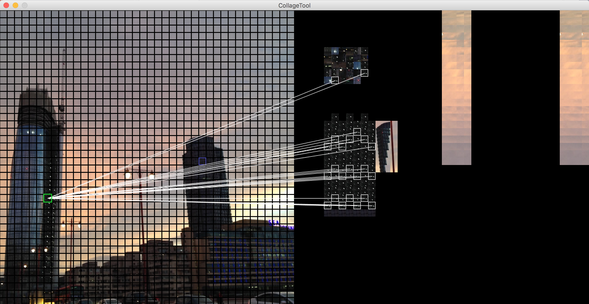

### Collage Tool

The program imposes the aesthetic constraint that the collage must be composed from equally sized square sections of the source image. The aim of this software is to provide an efficient way of making collages given this constraint.

A single square segment in the source image can be pasted (*mapped*, *assigned*) to any number of squares in the target grid. The relationship between Source Image sections and Collage sections is therefore one-to-many. This means the collage isn't a simple rearrangement of the square sections of the source image. The source image is more like a palette of colours that never runs out.

Simple transformations can be applied to groups of selected source sections. These transformations only ever reorder the square sections. They do not transform the individual pixels in an image section. You can 'reflect' the order of the squares about a group's local X or Y axis or alternatively randomly re-order of the squares in the group. These operations are useful when you are looking for rearrangements of clusters of square sections in the source image that might give rise to a subtle or interesting pattern.

All paste actions from the source image to the collage grid are written to a file which is represented in memory as the `CollageActionStore`. Overwriting a square in the collage with another one does not remove the record of the previous action. This means you have a complete history of the compositional process, which in its own right is aesthetically interesting.

This is an Eclipse Processing3 project which means:

[Processing in Eclipse](https://processing.org/tutorials/eclipse/)

**Potential Features**

* Undo button
* Automatically handle rectangular images (not sure resampling is worth it)
* Composition of Transformations of selected squares
* reassignment (move) squares within the Target Grid elsewhere in the Target Grid
* Delete mapping (tricky due to the way the CollageActionStore works)
* Animate the mapping history

**Useful Links**

* [Timing](https://processing.org/reference/millis_.html)
* [Tables](https://processing.org/reference/Table.html)
* [Processing + Maven + Eclipse](http://jtoprocessing.tumblr.com/post/63945371987/how-to-processing-maven-eclipse)
* [How not to display the class in git](https://stackoverflow.com/questions/14251253/how-not-to-display-the-class-in-git) - StackOverflow
* [Show Hidden Files in Eclipse](http://cesaric.com/?p=591) - cesaric.com
* [The Builder Pattern](http://www.vogella.com/tutorials/DesignPatternBuilder/article.html) - vogella.com
* [Vim: Remove unwanted spaces](http://vim.wikia.com/wiki/Remove_unwanted_spaces) - vim.wikia
* [Java 8 DateTime examples](https://gist.github.com/mscharhag/9195718) - mscharhag GitHub
* [Git: diff file against its last change](https://stackoverflow.com/questions/10176601/git-diff-file-against-its-last-change) - StackOverflow - `git diff remotes/origin/master master`

* [Git: Compare Local Branch with Remote Branch](https://stackoverflow.com/questions/1800783/compare-local-git-branch-with-remote-branch)
* [Vim: Search for a Pattern and if occurs Delete to End of Line](https://stackoverflow.com/questions/569280/vim-search-for-a-pattern-and-if-occurs-delete-to-end-of-line) - StackOverflow